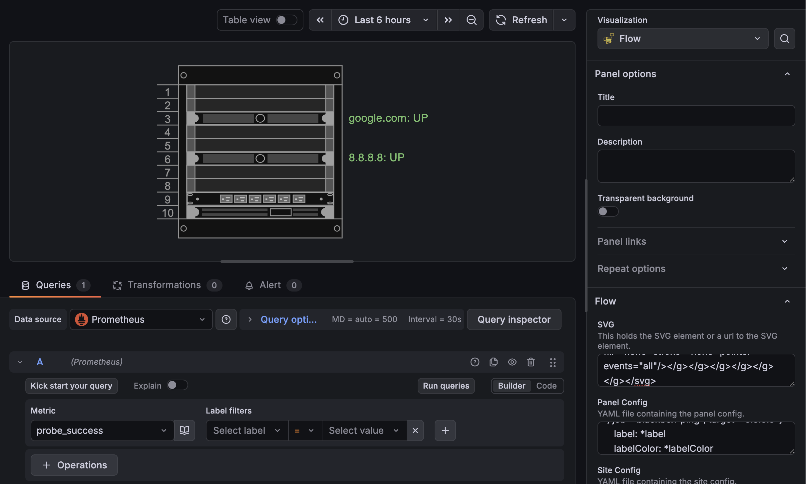

---
date:
  created: 2025-11-23
pin: true
authors:
  - connor
categories:
  - Monitoring
  - DevOps
  - Kubernetes
tags:
  - Monitoring
  - DevOps
  - Kubernetes
comments: true
---

# Live Server Rack Diagrams
Building and maintaining server racks often requires both accurate documentation and real-time visibility into which systems are online. In this post, I'll show how to make a live server rack diagram that combines a draw.io `.svg`, Prometheus, Blackbox Exporter and Grafana.

## Demo


## Why
I recently needed to label and verify hardware in a server rack and wanted a "live" server rack diagram to be able to tell what systems were up/down without manually checking. I was inspired by [a post on r/sysadmin](https://www.reddit.com/r/sysadmin/comments/13ox4rr/what_do_you_use_for_live_rack_diagrams/) to use Grafana and draw.io, but saw the FlowCharting plugin suggested was not maintained. I found the [Flow](https://grafana.com/grafana/plugins/andrewbmchugh-flow-panel/) plugin instead and liked it so much I decided to make this post. This solution lives entirely in Git for version control making it manageable for both small homelabs and larger environments. 

## Step-by-step Instructions
### Install Kubernetes Cluster
There are many options for a development Kubernetes cluster, a good overview is [here](https://docs.tilt.dev/choosing_clusters.html). For this project, I used [Rancher Desktop](https://rancherdesktop.io/) on macOS.

If you choose a different Kubernetes cluster option, be sure to install the following tools:  
- [kubectl](https://kubernetes.io/docs/tasks/tools/)  
- [helm](https://helm.sh/docs/intro/install/)  

### Install Prometheus Blackbox Exporter
Blackbox Exporter will be used to gather the ping test data to report up/down status of the servers in the rack. Any exporter or other data collection tool such as Zabbix could be used instead if preferred. 
Install [blackbox_exporter](https://github.com/prometheus/blackbox_exporter) by first adding the helm repo:
``` sh
helm repo add prometheus-community https://prometheus-community.github.io/helm-charts
helm repo update
```
Create a `blackbox_values.yaml` file to configure the chart to enable `http` and `icmp` up/down probe:
``` yaml title="blackbox_values.yaml"
config:
  modules:
    http_2xx: # (1)!
      http:
        follow_redirects: true
        preferred_ip_protocol: ip4
        valid_http_versions:
        - HTTP/1.1
        - HTTP/2.0
      prober: http
      timeout: 5s
    icmp: # (2)!
      prober: icmp
      timeout: 5s
      icmp:
        preferred_ip_protocol: ip4
```

1. Enable `http/https` probe
2. Enable `icmp/ping` probe

Then install the chart with the custom values to deploy blackbox exporter in the `monitoring` namespace:
``` sh
helm install blackbox-exporter prometheus-community/prometheus-blackbox-exporter \
  -f blackbox_values.yaml \
  -n monitoring --create-namespace
```

### Install Prometheus and Grafana
Prometheus will be used to scrape the up/down ping information and Grafana will display the dashboard.  

Install [kube-prometheus-stack](https://github.com/prometheus-community/helm-charts/tree/main/charts/kube-prometheus-stack) by first adding the helm repo:  
``` sh
helm repo add prometheus-community https://prometheus-community.github.io/helm-charts  
helm repo update
```
Create a `prometheus_values.yaml` file to configure the chart with the Grafana plugin, blackbox exporter, and hosts to probe for up/down status:
``` yaml title="prometheus_values.yaml"
grafana:
  plugins:
  - andrewbmchugh-flow-panel # (1)!
prometheus:
  prometheusSpec:
    additionalScrapeConfigs: |
      - job_name: blackbox-http
        metrics_path: /probe
        params:
          module: [http_2xx]
        static_configs:
          - targets: (2)
            - https://google.com
        relabel_configs:
        - source_labels: [__address__]
          target_label: __param_target
        - source_labels: [__param_target]   
          target_label: target
        - target_label: __address__ 
          replacement: blackbox-exporter-prometheus-blackbox-exporter.monitoring.svc.cluster.local:9115 (3)
      - job_name: blackbox-ping
        metrics_path: /probe
        params:
          module: [icmp]
        static_configs:
          - targets: (4)
            - 8.8.8.8
        relabel_configs:
        - source_labels: [__address__]
          target_label: __param_target
        - source_labels: [__param_target]   
          target_label: target
        - target_label: __address__ 
          replacement: blackbox-exporter-prometheus-blackbox-exporter.monitoring.svc.cluster.local:9115
```

1.  [Flow](https://grafana.com/grafana/plugins/andrewbmchugh-flow-panel/) plugin for Grafana providing `.svg` diagram support
2.  List of `http/https` targets to probe for up/down status
3.  DNS name of blackbox exporter service for prometheus to scrape
4.  List of `icmp/ping` targets to probe for up/down status

Then install the chart with the custom values to deploy the Prometheus and Grafana stack in the `monitoring` namespace:
``` sh
helm install kube-prometheus-stack prometheus-community/kube-prometheus-stack \
  -f prometheus_values.yaml \
  -n monitoring --create-namespace
```
Get Grafana 'admin' user password by running:
``` sh
kubectl --namespace monitoring get secrets kube-prometheus-stack-grafana -o jsonpath="{.data.admin-password}" | base64 -d ; echo  
```
Access your local Grafana instance on `http://localhost:3000` by port forwarding the Frafana pod:
``` sh
export POD_NAME=$(kubectl --namespace monitoring get pod -l "app.kubernetes.io/name=grafana,app.kubernetes.io/instance=kube-prometheus-stack" -oname)  
kubectl --namespace monitoring port-forward $POD_NAME 3000  
```

### Create Draw.io Server Rack Diagram
Open the draw.io online editor by going [here](https://app.diagrams.net/). Before creating the diagram, the `svgdata` plugin must be enabled by going to **Extras -> Plugins -> Add -> svgdata** to be able to save svg data IDs.

Any type of diagram can be used, but for this project I am creating a server rack diagram. Enable the server rack shapes by going to **+ More Shapes** in the bottom right and enabling the **Rack** shapes.

Add svg data IDs for any elements that will be tied to Prometheus items. To do this right click the element in draw.io **Edit Data... ->** and double click **ID** to set the svg data ID. In the below diagram I set a svg data ID to match the element label for the `google.com` element and the `8.8.8.8` element. These are the same hosts I specified in the Prometheus config for probing up/down status.

Once the diagram has been created, save it by going to **File -> Export as -> SVG...**

I created this simple `rack-diagram.drawio.svg` diagram for the project:  


### Create Grafana Dashboard
Access Grafana local instance on `http://localhost:3000` by port forwarding the Grafana pod if not already done so.

Create a new dashboard and add a visualization. Use **Prometheus** as the datasource and select **Flow** as the visualization type.

In the **Queries** section, select `probe_success` as the metric.

In the **Flow -> SVG** section add the content of the `rack-diagram.drawio.svg`:
``` title="rack-diagram.drawio.svg"
--8<-- "docs/blog/posts/2025-11-23-live-server-rack-diagrams/rack-diagram.drawio.svg"
```

Then in the **Flow -> Panel Config** section add the panel config to map the Prometheus blackbox exporter data to the svg elements:
``` yaml title="panel-config.yaml"
--8<-- "docs/blog/posts/2025-11-23-live-server-rack-diagrams/panel-config.yaml"
```

1. The `cells` list contains the list of draw.io elements to tie data to. `google.com` is the first element to configure.
2. The `dataRef` attribute is the data source for the information. In this case the probe success up/down status from blackbox exporter.
3. The `valueMappings` attribute can map the label depending on the data result. In this case, `1` and `0` from blackbox exporter map to the text `UP` and `DOWN` respectively. 
4. The `labelColor:thresholds` attribute can color the label depending on the data result. In this case, `0` and `1` map to `red` and `green` respectively. 
5. `8.8.8.8` is the second element to configure.
6. The `label` attribute is reused from the `google.com` element using yaml anchors.
7. The `labelColor` attribute is reused from the `google.com` element using yaml anchors.

The diagram labels should now be populated with data from Prometheus and show `: UP` similar to the image below:  



### GitOps
This solution also supports a GitOps workflow as the helm charts, diagram, and dashboard are all text based. As an alternative to following the above manual steps of deployment, this solution can be deployed with a GitOps tool such as Fleet or ArgoCD.

An example GitOps project for this same live server rack diagram can be found [here](https://github.com/connor-stewarty/live-server-rack-diagram). 

## Troubleshooting
* Labels aren't changing with the up/down status from Prometheus?
    * Ensure that the `svgdata` plugin has been enabled in draw.io and the svg data IDs match what is in the Flow panel config.
* Labels are cutoff or not showing fully?
    * If the diagram is too small, the labels can render outside of the diagram and be cutoff. One workaround is to add a large transparent rectangle around the diagram to make it larger.
* For more troubleshooting and debugging information check out the official [Flow plugin documentation](https://grafana.com/grafana/plugins/andrewbmchugh-flow-panel/).

## Sources
* [https://www.reddit.com/r/sysadmin/comments/13ox4rr/what_do_you_use_for_live_rack_diagrams/](https://www.reddit.com/r/sysadmin/comments/13ox4rr/what_do_you_use_for_live_rack_diagrams/)
* [https://grafana.com/grafana/plugins/andrewbmchugh-flow-panel/](https://grafana.com/grafana/plugins/andrewbmchugh-flow-panel/)
* [https://github.com/andymchugh/andrewbmchugh-flow-panel](https://github.com/andymchugh/andrewbmchugh-flow-panel)
* [https://medium.com/@platform.engineers/setting-up-a-prometheus-and-grafana-monitoring-stack-from-scratch-63667bf3e011](https://medium.com/@platform.engineers/setting-up-a-prometheus-and-grafana-monitoring-stack-from-scratch-63667bf3e011)
* [https://blog.devops.dev/prometheus-blackbox-exporter-with-kube-prometheus-stack-23a045ccbab2](https://blog.devops.dev/prometheus-blackbox-exporter-with-kube-prometheus-stack-23a045ccbab2)
* [https://stackoverflow.com/questions/55526487/how-to-ping-targets-using-blackbox-exporter-with-prometheus](https://stackoverflow.com/questions/55526487/how-to-ping-targets-using-blackbox-exporter-with-prometheus)
